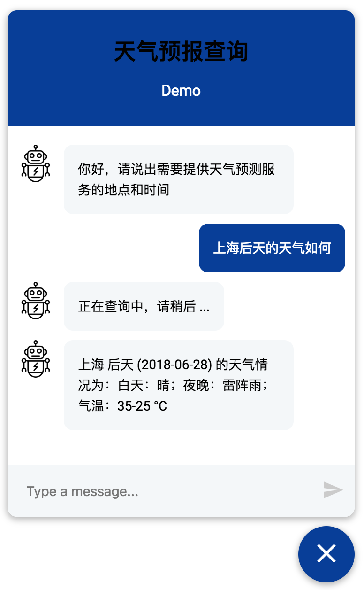

# WeatherBot
一个简单的中文天气情况问询机器人(chatbot), 附带 Web UI 界面

## 功能
这个机器人可以根据你提供的城市（北京、上海等）和日期（明天、后天等），查询出相应的天气预报。

## 功能截图


## 特性
使用 Frame-based 对话管理方案，如果上述两个 Slot (既城市和天气)，有任意一个用户未提供，对话管理系统会负责让你澄清相关 Slot 的值。

## 能力范围
* 受限于天气数据提供方的能力，这个机器人只能查询 **中国大陆地区市级城市** 三天以内 **（今天，明天，后天）** 的气象数据，**不能查询过去**（昨天，前天）等历史数据。
* 受限于开发时间，这个机器人 **不提供** 诸如 **这个星期五、下个星期一** 这种需要计算才能得到日期给定方式。也 **不能提供** 诸如 **绝对日期：三月一号、六一儿童节日** 这种日期的查询能力。
* 因为使用的是免费的天气查询接口，所以 **会有配额限制**，可能会因为 **超出调用次数** ，而在一个小时内不能用。同时网络查询接口可能存在不稳定因素，导致 **没有结果返回或者出现异常**，**尝试多次重新发送请求可解决问题**。

## 在线演示
[Demo for 天气预报查询机器人](http://weather_bot.xiaoquankong.ai/)

## 依赖
### python 版本
python 3
### python 依赖
```console
pip install -r requirements.txt
```

## 下载数据和模型
* `data/total_word_feature_extractor.dat`: 从 [https://github.com/howl-anderson/MITIE_Chinese_Wikipedia_corpus](https://github.com/howl-anderson/MITIE_Chinese_Wikipedia_corpus/releases/download/0.1/total_word_feature_extractor.dat.tar.gz) 下载，解压缩后放置到对应位置
* `models/default/current`：通过运行 `train_NLU.bash` 生成
* `models/dialogue`：通过运行 `train_CORE.bash` 生成

## 功能入口
### 申请 API key
本项目目前使用 [心知天气](https://www.seniverse.com/) 提供天气数据，该平台为个人提供免费的 API，但任然需要用户注册并申请 API key 才能使用。用户注册后可以自行找到 `我的API密钥`。

### 启动服务
将如下的 `xxx` 替换成你的 API key，然后执行即可

```bash
SENIVERSE_KEY=xxx python ./webchat.py
```

启动成功后，请用浏览器访问 [http://localhost:5500](http://localhost:5500) , 你将得到 web 页面，have fun!

## Docker 容器
见 [Dockerfile](Dockerfile)

## FAQ
* 如果在使用机器人中遇到解析失败或者 SSL 错误或者超时错误，请重试几次，数据提供商 `心知天气` 的 API 很不稳定，后续考虑替换成其他供应商

## TODO
* 使用更加 Robust 的对话管理方案,目前的方案无法处理意图切换等复杂场景.
* 使用 [duckling](https://github.com/facebook/duckling) 做时间和日期的识别,效果将更加 Robust 和准确

