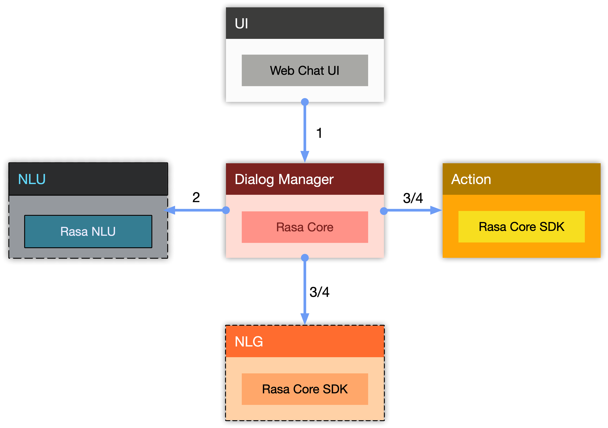

# WeatherBot
一个使用 Rasa 技术栈 （Rasa NLU, Rasa Core, Rasa Core SDK）构建的简单的中文天气情况问询机器人(chatbot), 附带有基于 Web 的用户界面（UI）

## 功能
这个机器人可以根据你提供的城市（北京、上海等）和日期（明天、后天等），查询出相应的天气预报。

## 功能截图

## 特性
使用 Frame-based 对话管理方案，如果上述两个 Slot (既城市和天气)，有任意一个用户未提供，对话管理系统会负责让你澄清相关 Slot 的值。

## 能力范围
* 受限于天气数据提供方的能力，这个机器人只能查询 **中国大陆地区市级城市** 三天以内 **（今天，明天，后天）** 的气象数据，**不能查询过去**（昨天，前天）等历史数据。
* 受限于开发时间，这个机器人 **不提供** 诸如 **这个星期五、下个星期一** 这种需要计算才能得到日期给定方式。也 **不能提供** 诸如 **绝对日期：三月一号、六一儿童节日** 这种日期的查询能力。
* 因为使用的是免费的天气查询接口，所以 **会有配额限制**，可能会因为 **超出调用次数** ，而在一个小时内不能用。同时网络查询接口可能存在不稳定因素，导致 **没有结果返回或者出现异常**，**尝试多次重新发送请求可解决问题**。

## 动画演示

## 在线演示
[Demo for 天气预报查询机器人](http://weather_bot.xiaoquankong.ai/)

## 文档说明
本项目采用了组件相互隔离(类似于微服务的思想)来构建整个系统。

整个系统分成 4 个 APP:

* `User Interface` 负责提供用户 UI ，方便用户使用，Rasa Core 支持和多种即时通讯软件（IM）的整合，Rasa Core 提供了一种称之为 Channel 的特性来方便接入 API。该组件使用的是在 [rasa-webchat](https://github.com/mrbot-ai/rasa-webchat) 基础上修改的代码，具体信息请访问 [WeatherBot_UI](https://github.com/howl-anderson/WeatherBot_UI)
* `Diaglog Manager` 负责管理整个对话的流程，它会主动调用 `NLU` 来解析用户的意图和提取相关的实体，在需要执行业务动作的时候会调用 `Action Server` 执行具体的业务动作。该组件使用的是 Rasa Core，具体信息请访问 [WeatherBot_Core](https://github.com/howl-anderson/WeatherBot_Core)。
* `NLU` 负责理解用户的意图和提取相关的实体。该组件使用的是 `Rasa NLU`, 具体信息请访问 [WeatherBot_NLU](https://github.com/howl-anderson/WeatherBot_NLU)。
* `Action Server` 负责执行自定义 Action (通常都是具体的业务动作，在本项目中是请求远程服务器以查询天气情况), 具体信息请访问 [WeatherBot_Action](https://github.com/howl-anderson/WeatherBot_Action)。

## FAQ
* 如果在使用机器人中遇到解析失败或者 SSL 错误或者超时错误，请重试几次，数据提供商 `心知天气` 的 API 很不稳定，后续考虑替换成其他供应商

## TODO
* 使用更加 Robust 的对话管理方案,目前的方案无法处理意图切换等复杂场景.
* 使用 [duckling](https://github.com/facebook/duckling) 做时间和日期的识别,效果将更加 Robust 和准确

